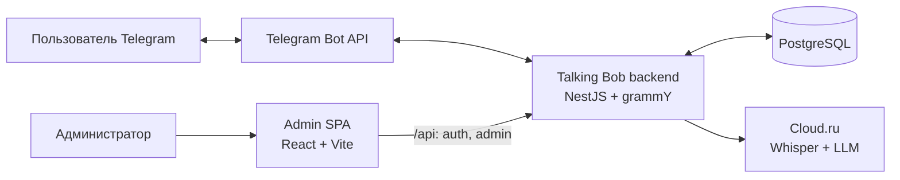
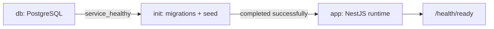

# Контекст системы

Talking Bob — один backend-процесс NestJS для практики разговорного английского в Telegram. Пользователь общается с ботом через Telegram Bot API; backend хранит состояние в PostgreSQL и обращается к Cloud.ru для распознавания речи и генерации ответов. Администратор работает с отдельным React-приложением, которое вызывает HTTP API backend.

## Границы и ответственность

- Telegram отвечает за доставку команд, голосовых сообщений и ответов бота. Backend запускает grammY polling; одновременно должен работать только один полный экземпляр приложения.
- Backend владеет прикладными сценариями, расписанием, ограничениями запросов, состоянием диалога и административным API.
- PostgreSQL — долговременное хранилище состояния. Модели и инварианты описаны в [контракте базы данных](../database.md).
- Cloud.ru — внешний AI-провайдер: отдельные вызовы используются для транскрибации и LLM-ответов. В текущем runtime нет TTS-сервиса.
- `admin/` — самостоятельный frontend-пакет. Его production-хостинг не является частью текущего backend Compose.

## Текущий процесс и Compose

В обычном запуске один процесс Node.js поднимает Nest HTTP API, Telegram polling и фоновые задачи. Его состав и пользовательское поведение описаны в [контракте приложения](../app.md).

Текущий Compose разворачивает только backend-контур:

`init` — одноразовый этап; `app` стартует только после его успешного завершения. Локальный Compose публикует backend и PostgreSQL только на loopback, production-вариант не публикует их порты. Команды запуска, проверки и восстановления остаются в [операционном руководстве](../operations.md).

Reverse proxy, TLS, размещение Admin SPA и прочая целевая инфраструктура не входят в эту схему текущего состояния; они перечислены в [плане deployment](../DEPLOYMENT_PLAN.md).
