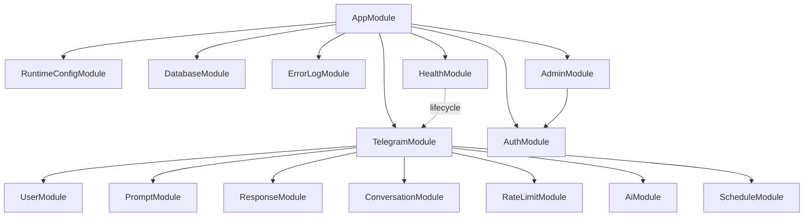
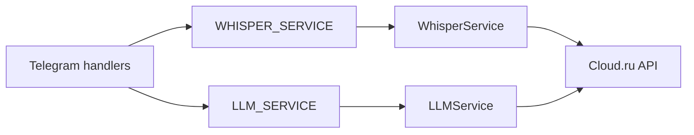

# Карта backend-модулей

`AppModule` — корень Nest-приложения. Он подключает инфраструктуру и верхнеуровневые HTTP/Telegram-контуры; `TelegramModule` служит composition root пользовательских сценариев бота.



## Владение зависимостями

- `DatabaseModule` глобально предоставляет `PrismaService`; доменные модули работают с БД через этот provider.
- `TelegramModule` владеет `TelegramService` и обработчиками `/start`, voice,
  report и settings. Handlers находятся на транспортной границе, но фактически
  являются application orchestrators: связывают несколько сервисов и Telegram
  I/O. Атомарные state transitions остаются в профильных сервисах.
- `ScheduleModule` входит в Telegram-контур: dispatcher получает активный экземпляр grammY-бота от `TelegramService`.
- `HealthModule` читает состояние `TelegramService` для readiness, но не владеет жизненным циклом бота.
- `AuthModule` предоставляет guard и auth-сервис; `AdminModule` использует их для защищённого административного API.

Детальные сценарии и ограничения являются частью [контракта приложения](../app.md), а владение моделями и транзакционные инварианты — [контракта базы данных](../database.md).

## Справочник ответственности

| Модуль | За что отвечает | Не должен владеть |
| --- | --- | --- |
| `RuntimeConfigModule` | Один validated config object для всего процесса | Чтение env внутри domain services |
| `DatabaseModule` | Lifecycle `PrismaService` и общий доступ к PostgreSQL | Бизнес-переходы отдельных агрегатов |
| `ErrorLogModule` | Correlation context, sanitized errors, retention cron | Пользовательские ответы и provider payload |
| `TelegramModule` | Polling runtime, middleware, commands/callbacks, orchestration | Прямое проектирование schema/migrations |
| `UserModule` | Регистрация пользователя и базовые settings | Выбор prompt и schedule claims |
| `PromptModule` | Чтение каталога и latest sent session | Delivery lifecycle |
| `ConversationModule` | Voice acceptance, message order, close и guarded follow-up | LLM/Telegram I/O |
| `ResponseModule` | Report generation/delivery claims, chunks и fencing | Формат Telegram context |
| `RateLimitModule` | Rolling/calendar admission и quota windows | Повтор внешнего действия |
| `AiModule` | Provider interfaces, implementations и bounded limiter | Conversation/report ownership |
| `ScheduleModule` | Время, prompt reservation, scheduled/manual delivery state | Telegram update routing |
| `HealthModule` | Process/DB/Telegram readiness projection | Recovery providers или delivery backlog |
| `AuthModule` | Admin identity, JWT и guard | Пользователь Telegram |
| `AdminModule` | Защищённые management/read API | Hosting Admin SPA |

## Карта каталогов

```text
src/main.ts                 bootstrap и HTTP listener
src/config/                 startup validation и runtime config
src/infrastructure/database Prisma lifecycle
src/infrastructure/http/    bounded external HTTP
src/shared/time/            timezone/DST primitives
src/modules/                Nest application modules
prisma/                     schema, migrations, seed
admin/                      отдельное React/Vite приложение
test/                       unit/integration-style runtime tests
integration/                explicit real-PostgreSQL test entrypoint
scripts/                    operations/container/PostgreSQL gates
```

`index.ts` внутри модуля задаёт его публичную поверхность. Межмодульный код
должен импортировать эту поверхность или injection token, а не внутренний
конкретный provider без необходимости.

## Граница AI

Потребители зависят от интерфейсов и symbol-токенов `WHISPER_SERVICE` и `LLM_SERVICE`, а не от конкретных Cloud.ru классов. `AiModule` связывает эти токены с `WhisperService` и `LLMService` и предоставляет общий `AiRequestLimiterService`.



Такой контракт сохраняет возможность заменить реализации провайдера без изменения обработчиков.

## Жизненный цикл процесса

1. `main.ts` валидирует runtime-конфигурацию, создаёт `AppModule.forRoot(...)`, включает shutdown hooks и запускает HTTP listener.
2. `PrismaService.onModuleInit` устанавливает соединение с PostgreSQL.
3. `TelegramService.onModuleInit` регистрирует middleware и handlers, передаёт bot dispatcher-у и запускает polling runner. Рабочая readiness достигается только в состоянии `running`.
4. При shutdown `TelegramService` закрывает admission новых AI/Telegram-задач, останавливает runner и ограниченно дожидается принятой работы; `PrismaService.onModuleDestroy` отключается от БД.

Операционные проверки и сроки graceful shutdown описаны в [операционном руководстве](../operations.md).
