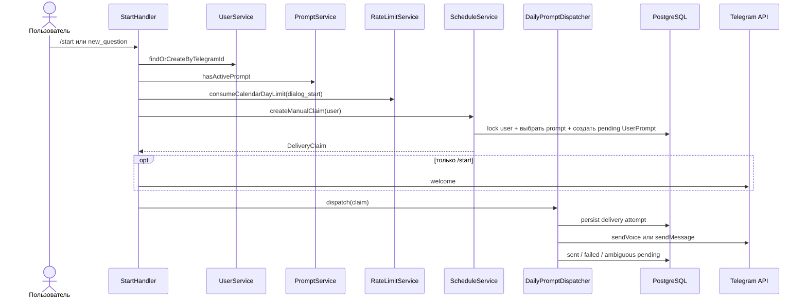
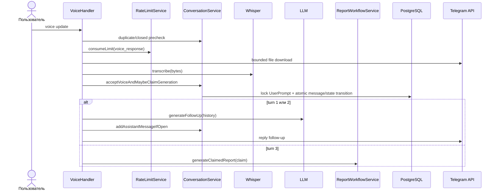

# Telegram, диалог и отчёт

Этот документ описывает интерактивный путь update от Telegram до устойчивого
состояния в PostgreSQL. Точные лимиты и пользовательские тексты находятся в
[application contract](../app.md).

## Входной конвейер

`TelegramService` регистрирует команды, voice update и callback handlers, а
затем запускает `@grammyjs/runner` с ограниченной глобальной конкуренцией.
Updates одного чата проходят последовательно; разные чаты могут обрабатываться
параллельно. Callback acknowledgement начинается до последовательной бизнес-
обработки, чтобы Telegram UI не ждал её завершения.

Каждый update получает correlation context. Внешний lifecycle middleware
отслеживает принятую бизнес-работу для graceful shutdown. После начала shutdown
новые updates не принимаются, а уже принятые business tasks и callback ACK могут
завершать Telegram API calls в пределах общего deadline. После завершения drain
или при достижении deadline API boundary закрывается и не допускает новые
вызовы.

| Update | Владелец orchestration | Основные зависимости |
| --- | --- | --- |
| `/start` | `StartHandler` | User, Prompt, RateLimit, Schedule, Dispatcher |
| `new_question` | `StartHandler.handleNewQuestion` | тот же flow без welcome |
| voice message | `VoiceHandler` | User, Prompt, Conversation, RateLimit, Whisper, LLM, ReportWorkflow |
| `/report`, `report` callback | `ReportHandler` | Admission, Response claim, ReportWorkflow |
| `/settings` и settings callbacks | `SettingsHandler` | User, Schedule |

Handlers связывают Telegram update с application-сценарием. Общая для auto и
manual report логика вынесена в `ReportWorkflowService`: генерация, подготовка
сохранённого отчёта и durable chunk delivery не принадлежат transport-handler.
Доменные переходы, требующие атомарности, находятся в профильных сервисах, а не
собираются из отдельных Prisma-запросов внутри handler или workflow.

## Новый вопрос

Выбор prompt и создание `UserPrompt` происходят в одной транзакции. История
manual и scheduled вопросов общая; недавние reservations исключаются до
детерминированного fallback для маленького каталога. Если claim не создан,
предварительно занятый quota slot освобождается. После сохранённого claim
Telegram failure quota уже не возвращает.

## Голосовой turn

`VoiceHandler` сначала выполняет дешёвые проверки Telegram metadata и
conversation state. Только затем он занимает rolling quota, скачивает файл с
ограничением времени/размера и вызывает Whisper через интерфейс
`IWhisperService`.

`ConversationService.acceptVoiceAndMaybeClaimGeneration` повторно проверяет
состояние под row lock и атомарно:

- подавляет duplicate update по `telegramUpdateId`;
- добавляет user message;
- для первых двух turns оставляет conversation открытым;
- на третьем turn закрывает conversation и, если owner ещё отсутствует, создаёт
  `UserResponse` с initial generation claim.

Для первых двух turns LLM строит follow-up по сохранённой истории.
`addAssistantMessageIfOpen` записывает ответ только если conversation ещё
открыт и соответствующий user turn остаётся последним. Это не позволяет
медленному LLM записать устаревший assistant message.

## Генерация и доставка отчёта

`ReportHandler` отвечает за admission ручного `/report` и отображение ранних
outcomes (`no_messages`, `busy`, retention). Generation claim или сохранённый
`UserResponse` он передаёт в `ReportWorkflowService`; delivery claim для
сохранённого ответа workflow получает сам. Для автоматического отчёта третьего
turn `VoiceHandler` вызывает тот же workflow напрямую; handler-to-handler
зависимости нет.

`UserResponse` — durable owner генерации. Автоматический owner создаётся внутри
транзакции принятия третьего turn; manual `/report` захватывает или reclaim-ит
его через `ResponseService.claimGeneration`. Unique relation и row locks
сериализуют оба пути. Один владелец получает lease token; остальные видят
`busy`, уже сохранённый результат или terminal failure данного request key.

После LLM analysis отчёт форматируется как plain text, делится на Telegram-safe
chunks и в одной транзакции переводится в `generated` вместе с первой delivery
claim. Повторный `/report` не вызывает LLM: он создаёт новый идемпотентный
`ReportDeliveryRequest` для сохранённого результата.

Перед отправкой каждого report chunk сервис сохраняет `deliveryAttemptedAt`.
После успешной отправки cursor продвигается с проверкой chunk index и attempt
timestamp.
`GrammyError` считается определённым отказом и переводит request в `failed`;
transport/unknown outcome остаётся неоднозначным `pending` и автоматически не
повторяется. Это защищает от двойной отправки после потери ответа Telegram.

## Как безопасно менять flow

- Новый Telegram entrypoint регистрируйте в `TelegramService`, возвращая promise
  handler целиком.
- Не переносите row locks, claim tokens и state transitions из сервисов в
  handler.
- Durable prompt/report delivery должен иметь сохранённый attempt marker до I/O
  и явную классификацию definite/ambiguous outcome.
- Для AI используйте injection tokens, общий limiter и bounded HTTP boundary.
- Минимальные проверки: `test/telegram-runtime-concurrency.test.js`, профильный
  handler test и `test/user-journey.test.js`; изменения lifecycle дополнительно
  проверяйте PostgreSQL gate.

Связанные документы: [карта backend-модулей](02-backend-module-map.md),
[данные и состояния](05-data-and-state.md), [database contract](../database.md).
