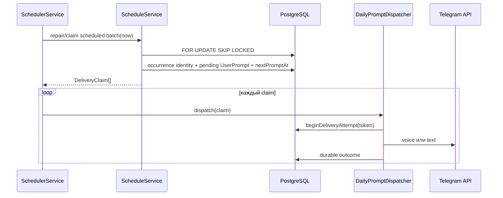
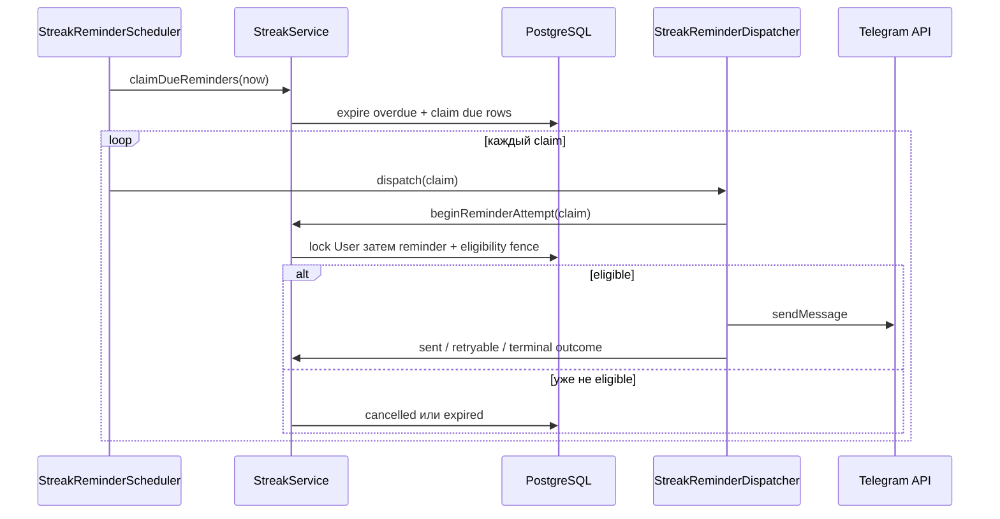

# Фоновые процессы

Фоновые процессы используют те же durable state и delivery primitives, что и
интерактивный Telegram flow. В памяти нет отдельной надёжной очереди: PostgreSQL
является источником ownership, idempotency и recovery.

## Расписание вопросов

`ScheduleService` отвечает за вычисление времени, выбор prompt и переходы
delivery lifecycle. `SchedulerService` — минутный cron-orchestrator.
`DailyPromptDispatcher` — единственная граница отправки вопроса в Telegram и
используется как scheduled flow, так и `/start`.

При старте `ScheduleService.onModuleInit` нормализует legacy/inconsistent
schedule state, но не рассылает пропущенные вопросы. В рабочем цикле cron:

### Почему overlap безопасен

- due users выбираются через `FOR UPDATE SKIP LOCKED`;
- occurrence имеет уникальный ключ пользователя и локальной даты;
- advance расписания и reservation создаются одной транзакцией;
- lease token и attempt marker ограждают устаревшего воркера;
- ambiguous attempted delivery не reclaim-ится автоматически.

Это разрешает краткий overlap scheduler workers, но не разрешает два полных
приложения, одновременно выполняющих Telegram long polling.

### Время

Бизнес-вычисления используют effective IANA timezone пользователя и Temporal,
а persisted instants хранятся в UTC `timestamptz`. DST gap сдвигается к первой
валидной минуте, overlap выбирает ранний instant. Process/DB `TZ` не участвует
в бизнес-решении. Полный контракт находится в [app.md](../app.md) и
[database.md](../database.md).

## Delivery outcome

Dispatcher сначала фиксирует начало попытки, затем вызывает Telegram:

- prompt с `audioFileId`: сначала `sendVoice`; при определённом Telegram отказе
  допустим text fallback;
- prompt без audio: `sendMessage`;
- успех: `UserPrompt.deliveryStatus = sent`;
- определённый Telegram отказ: `failed`;
- transport/unknown: `pending` с attempt marker без автоматической повторной
  отправки.

Обычные scheduled sends не расходуют `dialog_start` quota. Manual `/start` и
`new_question` создают claim через тот же `ScheduleService` и отправляются тем
же dispatcher, но admission выполняют заранее.

## Напоминания о стрике

`StreakReminderScheduler` запускается каждую минуту. `StreakService` выбирает
due `streak_reminders` батчами через `FOR UPDATE ... SKIP LOCKED`, выдаёт
двухминутную lease и допускает reclaim только пока Telegram attempt ещё не
начат либо после явного retry-safe отказа. `StreakReminderDispatcher` получает
активный grammY bot от `TelegramService`.

Последняя проверка перед Telegram I/O требует включённую настройку, активный
ненулевой streak, rescue-день сразу после последней квалификации, отсутствие
`StreakDay` сегодня и непросроченные user/reminder deadlines. Закрытие диалога,
выключение reminder, смена времени или timezone отменяют ещё не начатые stale
rows и пересчитывают `nextStreakReminderAt`.

Определённые Telegram `429` и `5xx` повторяются с exponential backoff от одной
минуты до одного часа, только если следующая попытка раньше локальной полуночи.
Остальные definite ошибки и transport/unknown outcomes терминальны. Перед I/O
сохраняется `deliveryAttemptedAt`, поэтому неоднозначный outcome не может быть
автоматически отправлен второй раз после рестарта.

## Rate limits и quota windows

Rolling quotas атомарно потребляются через `RateLimitService.consumeLimit`.
Локальный дневной `dialog_start` использует persisted `QuotaWindow` с snapshot
timezone и фиксированными UTC bounds. User row lock сериализует конкурирующие
consume/release; поэтому смена timezone внутри активного окна не создаёт новый
лимит.

`UserRequest` — факт потребления, а не task queue. Удалять requests активного
окна нельзя: иначе retention откроет дополнительные quota slots.

## Retention

`DataRetentionService` запускается ежедневно и в одной транзакции очищает
только данные старше настроенных cutoffs:

- удаляет report delivery requests и conversation messages старых закрытых
  разговоров;
- очищает voice identifier, transcript и analysis, сохраняя lifecycle;
- удаляет старые request-аудиты, только не из активных quota windows;
- удаляет orphan quota windows и старые sanitized error logs.

Cron получает отдельный correlation context. Ошибка cleanup не скрывается, но
записывается через allowlist-only `ErrorLogService` без содержимого разговора.

## Shutdown и recovery

При shutdown Telegram admission закрывается первым. Приложение останавливает
runner и ждёт принятые business tasks, callback acknowledgements и AI tasks до
единого deadline. Cron ownership остаётся durable в БД; новый процесс может
reclaim-ить только разрешённые unattempted expired leases.

In-memory работа не является durable queue: аварийное завершение может оборвать
активный handler. Durable prompt/report delivery защищены persisted claims,
attempt markers и idempotency keys, а ephemeral replies завершаются best effort
в пределах drain deadline.

## Как безопасно менять фоновые процессы

- Сначала определите durable owner и unique identity работы.
- В одной транзакции захватывайте ownership и меняйте связанное schedule state.
- Не повторяйте ambiguous external I/O автоматически.
- Соблюдайте единый порядок row locks, чтобы не создавать deadlock между manual
  и scheduled flow.
- Проверяйте изменения через `test/schedule-lifecycle.test.js`,
  `test/daily-prompt-dispatcher.test.js`, `test/streak-lifecycle.test.js`,
  calendar quota tests и `npm run test:postgres`.

Связанные документы: [Telegram flow](03-telegram-conversation.md),
[данные и состояния](05-data-and-state.md), [operations runbook](../operations.md).
