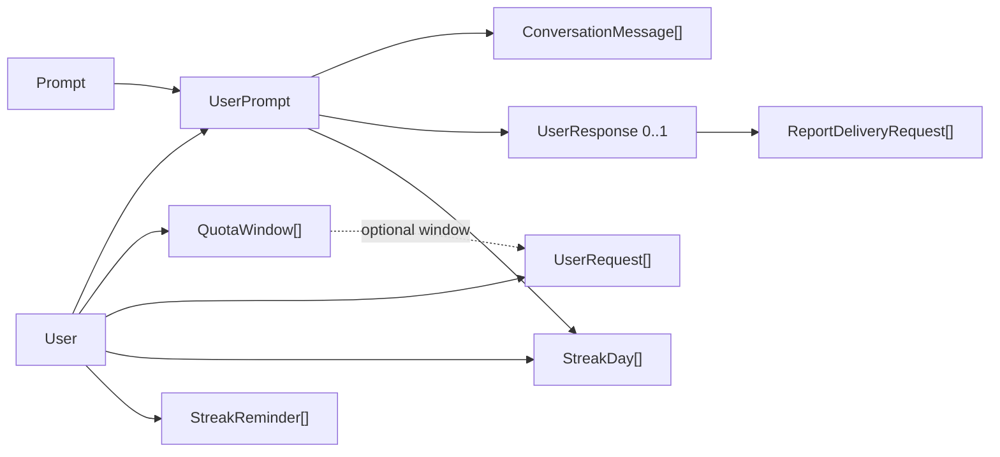
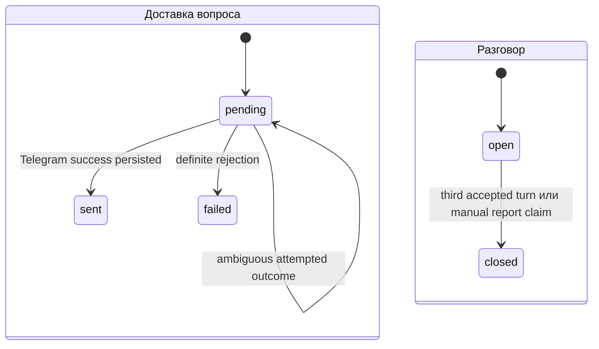
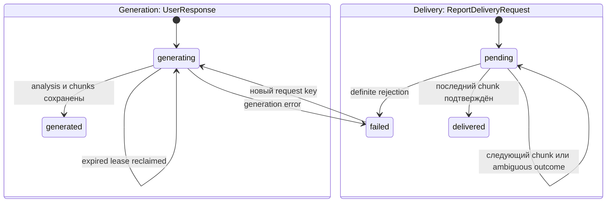
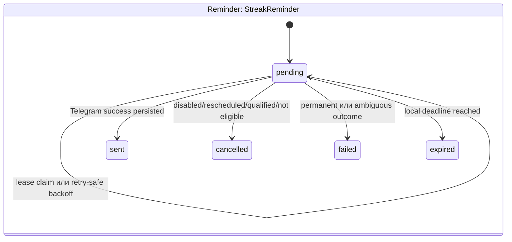

# Данные и состояния

Prisma schema содержит девятнадцать моделей. Архитектурно они образуют не
независимые CRUD-таблицы, а несколько агрегатов с разными владельцами
переходов.
Точные поля, enum, индексы, CHECK/trigger invariants и миграции описаны в
[database contract](../database.md).

## Группы данных

| Группа | Модели | Владелец поведения |
| --- | --- | --- |
| Пользователь и настройки | `User` | `UserService`, `ScheduleService`, `StreakService` |
| Каталог вопросов | `Prompt` | `PromptService`, admin API |
| Практическая сессия | `UserPrompt`, `ConversationMessage` | `ScheduleService`, `ConversationService` |
| Отчёт и его доставка | `UserResponse`, `ReportDeliveryRequest` | `ResponseService` |
| Стрик и напоминания | `StreakDay`, `StreakReminder` | `StreakService`, `StreakReminderDispatcher` |
| Admission/audit | `UserRequest`, `QuotaWindow` | `RateLimitService` |
| Admin identity | `AdminUser` | `AuthService` |
| Наблюдаемость | `ErrorLog` | `ErrorLogService`, retention |

`UserPrompt` — центральная запись пользовательской сессии. Она связывает
пользователя и prompt, хранит delivery/conversation state и владеет ordered
conversation messages. На одну сессию существует не больше одного
`UserResponse`; у сохранённого ответа может быть несколько независимых
`ReportDeliveryRequest`.

## Жизненный цикл сессии

У `UserPrompt` две связанные, но независимые оси состояния:

Только последний `sent` `UserPrompt` принимает voice messages. `pending` не
означает «можно безопасно повторить»: наличие `deliveryAttemptedAt` отделяет
неизвестный внешний outcome от ещё не начатой попытки.

`ConversationMessage.telegramUpdateId` обеспечивает dedupe Telegram update.
Порядок сообщений определяется persisted order; assistant message записывается
guarded transition, а не простым insert после LLM.

## Жизненный цикл отчёта

Generation и delivery разделены намеренно. LLM analysis выполняется один раз и
сохраняется; повторный `/report` создаёт новую delivery identity и не генерирует
контент заново. `requestKey` делает повтор одного Telegram request идемпотентным,
а новый request позволяет явно переотправить сохранённый результат.

## Жизненный цикл стрика

`StreakDay` — immutable квалификация локального календарного дня. Unique
`userId, localDate` не позволяет нескольким закрытым разговорам увеличить
серию повторно, а nullable unique `sourceUserPromptId` связывает первую
квалификацию с закрывшей её сессией. `User.currentStreak`, `longestStreak`,
`lastStreakLocalDate` и lifecycle instants — денормализованная проекция;
эффективный current равен нулю после `streakExpiresAt`.

У одного пользователя и rescue local date существует одна durable reminder
identity. `nextStreakReminderAt` на `User` — индексированный due-pointer, а не
отдельная очередь. До Telegram I/O attempt-транзакция блокирует сначала `User`,
затем `StreakReminder`, повторно проверяет eligibility и сохраняет attempt
marker. Это тот же порядок мутаций, что у qualification, и он исключает
deadlock в гонке закрытия диалога с отправкой.

## Транзакционные правила

### Row locks

Сервисы берут `FOR UPDATE` на корневую запись агрегата до решения о переходе:

- `User` — schedule selection и quota window;
- `UserPrompt` — voice acceptance, conversation close и generation ownership;
- `User` → `StreakReminder` — qualification/settings и reminder attempt;
- `UserResponse` — generation completion/reclaim;
- `ReportDeliveryRequest` — cursor и delivery outcome.

Manual и scheduled paths должны брать locks в совместимом порядке. SQL locks
используются там, где Prisma API не выражает нужную семантику.

### Claims, leases и fencing

Lease отвечает на вопрос «кто сейчас может работать». Для Telegram delivery
истечение lease само по себе не доказывает, что внешний side effect не
произошёл, поэтому attempted delivery автоматически не reclaim-ится. Генерация
отчёта — отдельный случай: её expired lease можно reclaim-ить, а claim-token
fencing не позволит устаревшему воркеру сохранить результат.

Completion принимает не только ID:

- generation проверяет claim token;
- prompt delivery проверяет claim token и attempt state;
- report chunk проверяет token/index/attempt timestamp;
- stale callback не меняет cursor, status или error metadata.

### Definite и ambiguous outcome

После внешнего I/O есть три результата:

1. подтверждённый success — можно сохранять terminal success;
2. определённый отказ — можно сохранять `failed`;
3. неизвестный результат — нельзя автоматически повторять side effect.

Эта модель используется и для prompt, и для report delivery.

## Retention и историчность

Lifecycle/provenance живут дольше чувствительного контента. После retention
может остаться информация, что сессия закрыта и отчёт был сформирован, но voice
identifier, transcript, analysis, messages и delivery rows будут удалены или
очищены. Поэтому архитектурный код не должен считать наличие lifecycle равным
наличию содержимого.

Backlog и migration history объясняют происхождение схемы, но текущий runtime
должен опираться на Prisma schema и актуальные SQL invariants, а не на старые
формы данных.

## Как безопасно менять данные

- Назначьте один сервис владельцем нового state transition.
- Для новой автоматически повторяемой доставки с внешним side effect сначала
  спроектируйте durable identity, attempt state и outcome policy.
- Изменение schema сопровождайте migration, backfill-политикой и rollback
  оценкой; не редактируйте уже применённые миграции.
- Проверяйте stale token/index callbacks и rollback всей транзакции.
- Минимальные gates: профильные lifecycle tests, `npx prisma validate`,
  `npx prisma generate` и `npm run test:postgres` для lock/constraint semantics.

Связанные документы: [Telegram flow](03-telegram-conversation.md),
[фоновые процессы](04-background-jobs.md), [database contract](../database.md).
