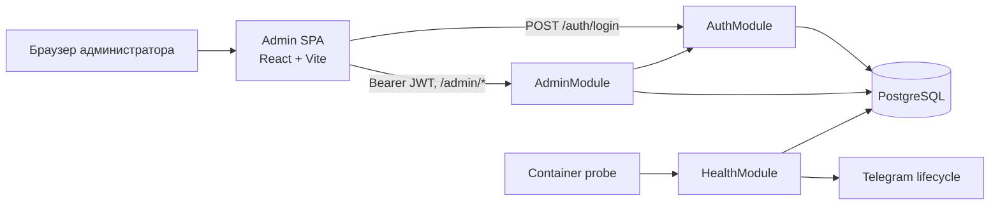
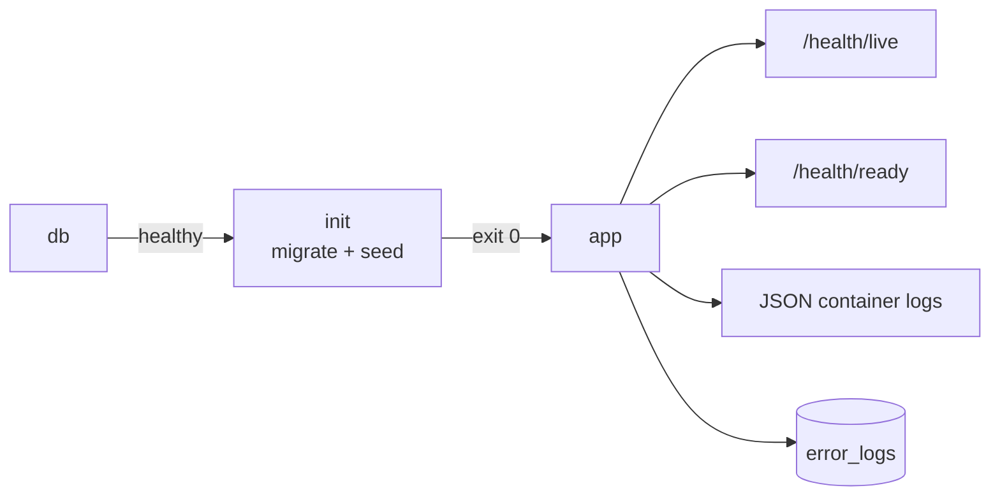

# Admin и операционный контур

Административная часть разделена на защищённый API внутри NestJS и отдельное React/Vite-приложение. Health endpoints принадлежат backend и используются оркестратором независимо от Admin SPA.

## Backend-поверхности

- `AuthModule`: `POST /auth/login` выдаёт JWT, `GET /auth/me` проверяет текущего администратора. `AuthGuard` извлекает Bearer token и защищает Admin API.
- `AdminModule`: предоставляет dashboard, просмотр и изменение пользователей,
  статистику по темам, CRUD каталога prompts, а также просмотр error logs и
  удаление записей старше заданного срока. Контроллер целиком защищён
  `AuthGuard`.
- `HealthModule`: `GET /health/live` проверяет, что процесс отвечает; `GET /health/ready` требует доступной БД и состояния Telegram `running`. При неготовности наружу возвращается санитизированная ошибка без внутренних деталей.

Точные payload, правила авторизации и поведение функций описаны в [контракте приложения](../app.md); структура административных данных — в [контракте базы данных](../database.md).

## Отдельный Admin SPA

Каталог `admin/` — самостоятельный пакет со своими зависимостями, lock-файлом и командами Vite. SPA хранит JWT в браузере, добавляет его к `/api`-запросам и возвращает пользователя на login после `401`. В development Vite proxy снимает префикс `/api` и направляет запросы в backend.

Root `package.json`, `Dockerfile` и Compose не собирают и не раздают Admin SPA. Production reverse proxy, TLS, публикация SPA и маршрутизация `/api` относятся к [плану deployment](../DEPLOYMENT_PLAN.md), а не к текущему runtime.

## Развёртывание и наблюдаемость

- `db` проходит собственный `pg_isready`; затем одноразовый `init` применяет migrations и idempotent seed; только после успешного `init` запускается `app`.
- Container healthcheck backend использует `/health/ready`, поэтому учитывает и БД, и Telegram polling.
- Контейнеры пишут ротируемые JSON-логи. Явно перехваченные структурированные
  ошибки сохраняются в `error_logs`, по возможности с correlation context, и
  доступны через Admin API.
- Одновременный запуск нескольких polling-инстансов не поддерживается текущей архитектурой.

Практические команды, проверки health, backup/restore и действия при сбоях находятся в [операционном руководстве](../operations.md). Эта страница фиксирует только границы и связи, не заменяя runbook.
